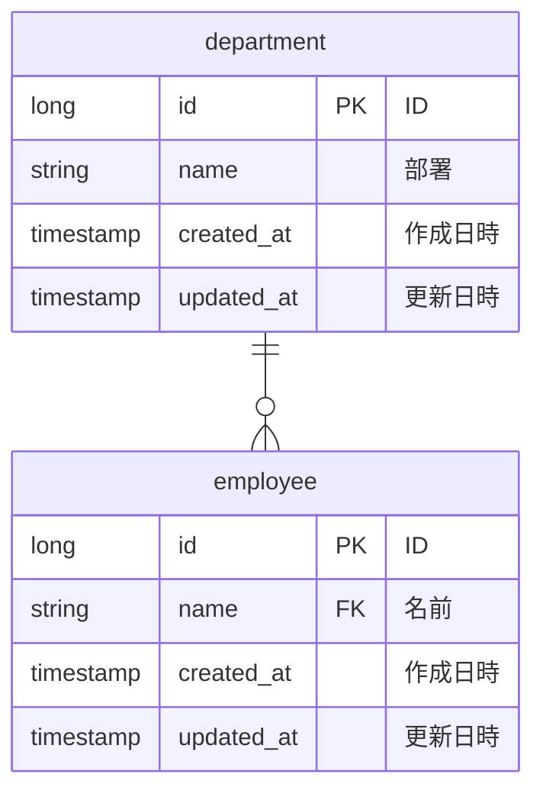

# ER図

## データベース

```mermaid
erDiagram
    department ||--o{ employee : ""

    department {
        long id PK "ID"
        string name "部署"
        timestamp created_at "作成日時"
        timestamp updated_at "更新日時"
    }

     employee {
        long id PK "ID"
        string name FK "名前"
        timestamp created_at "作成日時"
        timestamp updated_at "更新日時"
    }
```